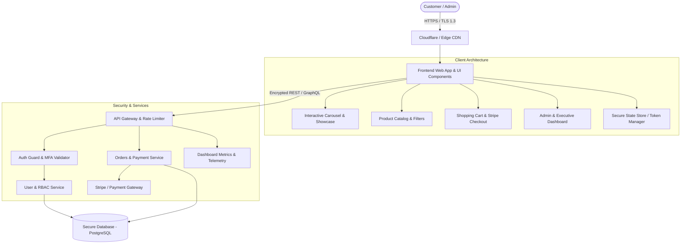

# 🚀 Enterprise Business & E-Commerce Web Platform
## Master Product Requirements Document (PRD), Technical Architecture & AI Implementation Blueprint

---

## 📌 1. Project Overview & Vision

### 1.1 Executive Summary
This document serves as the **Single Source of Truth (SSOT)** for architecting, designing, developing, securing, and testing a world-class, enterprise-grade business & e-commerce platform. It provides clear, unambiguous guidelines tailored for both human engineers and AI coding agents to eliminate ambiguity and prevent hallucinations.

### 1.2 Core Pillars
* **Aesthetic Excellence:** Modern, Figma-caliber bespoke visual design with sophisticated color harmonies, fluid micro-interactions, responsive typography, and 60fps silky smooth animations.
* **Bank-Grade Security:** Zero-trust architecture, OWASP Top 10 protection, robust multi-factor authentication (MFA/2FA), encrypted sessions, strict CORS/CSP policies, and role-based access control (RBAC).
* **Engineering Standards:** Modular architecture, TypeScript strict-mode adherence, reusable design-system components, deterministic state management, and high-coverage automated testing.
* **Customer & Executive Experience:** High-converting storefront, interactive showcase sliders, and an intuitive, feature-rich admin & customer dashboard.

---

## 🎨 2. UI/UX Design System & Styling Guidelines (Figma-Caliber)

### 2.1 Color Palette & Token System
The interface utilizes an ultra-refined luxury palette designed for high contrast, accessibility (WCAG 2.1 AA compliant), and brand authority.

| Token Name | Hex Code | HSL / RGB | Usage Context |
| :--- | :--- | :--- | :--- |
| `--color-primary-900` | `#0F172A` | `hsl(222, 47%, 11%)` | Deep Slate / Dominant Dark Canvas |
| `--color-primary-600` | `#2563EB` | `hsl(221, 83%, 53%)` | Royal Blue / Primary Brand Accent & CTA |
| `--color-primary-400` | `#60A5FA` | `hsl(213, 94%, 68%)` | Vibrant Highlight / Hover State |
| `--color-accent-gold` | `#D97706` | `hsl(38, 92%, 50%)` | Prestige Amber / Badges & Ratings |
| `--color-accent-emerald`| `#10B981` | `hsl(160, 84%, 39%)` | Success State / Trust Indicators |
| `--color-surface-card` | `rgba(255, 255, 255, 0.05)` | Glassmorphic base | Frosted backdrop cards & containers |
| `--color-surface-border`| `rgba(255, 255, 255, 0.12)` | Subtle glass border | Elegant hairline dividers |
| `--color-text-primary` | `#F8FAFC` | `hsl(210, 40%, 98%)` | Headings and primary labels |
| `--color-text-secondary`| `#94A3B8` | `hsl(215, 20%, 65%)` | Subtitles, descriptions, muted copy |

### 2.2 Typography Hierarchy
* **Primary Font (Headings):** `Plus Jakarta Sans` or `Outfit` (Modern, geometric, confident).
* **Secondary Font (Body & Data):** `Inter` (Optimized for ultra-legible screen reading and dashboard metrics).
* **Scale:**
  * **Display Hero:** `3.5rem` (56px) - `4.5rem` (72px) | Font Weight: 800 | Line-height: 1.1
  * **H1 / Section Titles:** `2.5rem` (40px) | Font Weight: 700 | Line-height: 1.2
  * **H2 / Card Headers:** `1.75rem` (28px) | Font Weight: 600 | Line-height: 1.3
  * **H3 / Subheads:** `1.25rem` (20px) | Font Weight: 600 | Line-height: 1.4
  * **Body Regular:** `1rem` (16px) | Font Weight: 400 | Line-height: 1.6
  * **Caption / Micro-copy:** `0.875rem` (14px) | Font Weight: 500 | Line-height: 1.5

### 2.3 Motion Design & Interactive Slides
* **Hero Slider:**
  * Dynamic, touch-enabled & keyboard-accessible carousel with auto-play pause on hover.
  * Kinetic typography with staggered reveal animations (`translateY(20px)` to `0`, `opacity` from `0` to `1`).
  * Parallax background depth on mouse movement or scroll.
* **Micro-Animations:**
  * Smooth card hover elevations with subtle glow border shaders (`box-shadow: 0 10px 30px -10px rgba(37, 99, 235, 0.25)`).
  * Magnetic button hover pull and ripple click feedbacks.
  * Skeleton loader pulses for asynchronous data fetching.
  * Frame rate benchmark: Guaranteed 60 FPS transitions using CSS GPU transforms (`transform: translate3d(...)`, `will-change: transform, opacity`).

---

## 🔒 3. Enterprise Security Architecture

### 3.1 Authentication & Authorization
* **Dual-Token Architecture:**
  * **Access Token:** Short-lived JWT (15 minutes), passed via in-memory state or secure authorization headers.
  * **Refresh Token:** Long-lived (7 days), stored strictly in `HttpOnly`, `Secure`, `SameSite=Strict` browser cookies to mitigate XSS and CSRF.
  * **Token Rotation:** Every refresh issuance invalidates the previous refresh token and flags potential token reuse anomalies.
* **Multi-Factor Authentication (MFA / 2FA):**
  * Time-based One-Time Password (TOTP) compatible with Google Authenticator / Authy.
  * Encrypted backup recovery codes generated upon setup.
* **Role-Based Access Control (RBAC):**
  * Hierarchical privileges: `SUPER_ADMIN`, `STORE_MANAGER`, `SUPPORT_AGENT`, and `CUSTOMER`.
  * Middleware route guards intercepting client and server-side navigation.

### 3.2 Threat Mitigation (OWASP Top 10 Standards)
* **XSS Prevention:** Strict output encoding, Content Security Policy (`CSP`) headers, no raw `innerHTML` injections.
* **CSRF Mitigation:** Anti-CSRF double-submit cookie tokens + `SameSite=Strict` cookie policies on all mutating routes.
* **Brute-Force & Rate Limiting:**
  * Rate-limiting on authentication endpoints (e.g., maximum 5 failed attempts per 15 minutes per IP).
  * Exponential backoff and CAPTCHA challenge on repeated failures.
* **Data Sanitation & Validation:**
  * Universal schema validation using `Zod` or `Joi` on all client inputs, server endpoints, and query parameters.
  * SQL/NoSQL injection immunity via parameterized queries and modern ORMs.
* **Sensitive Data Protection:**
  * Passwords hashed using `Argon2id` or `Bcrypt` (cost factor >= 12).
  * Sensitive configuration keys isolated via encrypted environment variables.

---

## 💻 4. Tech Stack & Software Architecture

### 4.1 Recommended Technology Stack
* **Frontend Layer:** React / Next.js or Modern Modular JavaScript with Vite.
* **Styling Layer:** Modular Vanilla CSS / CSS Custom Properties with Glassmorphic tokens (or modern Tailwind CSS if opted).
* **State Management:** Lightweight deterministic store (Zustand or Redux Toolkit) with offline-safe sync.
* **Backend / API Layer:** Node.js (Express / Fastify / Next.js API Routes) or Serverless Edge handlers.
* **Database & ORM:** PostgreSQL / SQLite with Prisma ORM or Supabase.
* **Testing Ecosystem:** Vitest / Jest (Unit & Integration), Testing Library (Component UI), Playwright (End-to-End).

### 4.2 Application Architecture Diagram



---

## 📦 5. Core Functional Modules

### 5.1 Public Storefront & High-Converting Landing Page
1. **Top Navigation Bar:** Sticky frosted glass header with brand logo, search modal, category links, currency/language switcher, cart trigger with dynamic badge, and profile menu.
2. **Hero Presentation Section:** Dynamic slides with promotional banners, seasonal launches, CTA buttons ("Shop Collection", "Explore Showcase"), and background video/image transitions.
3. **Featured Categories & Flash Sales:** Live countdown timer, discounted item ribbons, and grid/carousel layout toggles.
4. **Product Grid & Filters:**
   * Multi-faceted filtering (Price range slider, Category, Brand, In-Stock, Rating).
   * Sorting (Price Low-to-High, Newest Arrivals, Bestsellers).
   * Quick View modal with image gallery zoom, color swatch selection, and inventory stock indicator.
5. **Interactive Cart Drawer:** Slide-out drawer displaying item count, subtotal, tax estimation, promo code input, and one-click checkout button.
6. **Trust & Social Proof Section:** Customer reviews carousel, verified buyer badges, warranty guarantees, and SSL security seals.

### 5.2 Secure Authentication Suite
1. **Sign Up / Registration:** Form validation with real-time password strength meter, email verification workflow, and Terms agreement.
2. **Sign In / Login:** Single-step or multi-step modal with "Remember Me", OAuth2 social options (Google, Apple), and forgot password recovery.
3. **MFA Verification Screen:** 6-digit TOTP input with auto-advance and fallback backup code link.
4. **Account Recovery:** Secure time-stamped tokenized password reset links sent via email.

### 5.3 Executive & Customer Dashboard
1. **Customer Portal:**
   * Order history with real-time status badges (`Processing`, `Shipped`, `Delivered`, `Cancelled`).
   * Live parcel tracking timeline widget.
   * Saved shipping/billing addresses and profile preferences.
   * Saved wishlist with one-click "Move to Cart".
2. **Admin Control Center:**
   * **KPI Stat Cards:** Total Revenue, Active Orders, Conversion Rate, Low Stock Alerts with percentage increase/decrease indicators.
   * **Analytics Chart:** Visual revenue trends and sales volume by period (Day/Week/Month).
   * **Product Inventory Management:** CRUD table with bulk actions, instant search, stock adjustment, and price editor.
   * **Order Fulfillment Pipeline:** Status update dropdowns, packing slip generator, and customer refund handler.
   * **Security Audit Logs:** Chronological record of login events, privilege changes, and administrative actions.

---

## 🧪 6. Testing Strategy & Quality Assurance

### 6.1 Testing Pyramid Breakdown

| Test Type | Target Coverage | Framework | Scope & Focus |
| :--- | :--- | :--- | :--- |
| **Unit Tests** | >= 90% | Vitest / Jest | Pure utility functions, currency formatters, validation schemas, auth token parsing |
| **Component Tests**| >= 85% | React Testing Library | Render verification, state triggers, accessibility tags, click events, cart tallying |
| **Integration Tests**| >= 85% | Supertest / Vitest | API route handlers, database transactions, auth middleware guard assertions |
| **E2E Tests** | Critical paths | Playwright | Full checkout journey, login + MFA flow, admin product creation, responsive layout tests |

### 6.2 Mandatory Test Cases
* **AUTH-01:** Successful login returns 200, sets `HttpOnly` refresh cookie, and returns short-lived access token.
* **AUTH-02:** Rate-limiting blocks IP on the 6th consecutive incorrect password attempt with HTTP 429.
* **CART-01:** Adding items correctly calculates subtotal, applied discount codes, and local sales tax without rounding errors.
* **CHECKOUT-01:** Payment gateway failure gracefully displays error banner without abandoning session state.
* **SEC-01:** SQL injection strings in search queries or filters are sanitized and return empty results without database error exposure.
* **DASH-01:** Non-admin accounts attempting access to `/admin` are redirected to `/login` with an unauthorized warning.

---

## 📐 7. AI Implementation Rules & Zero-Confusion Guidelines

To ensure any AI model or engineer creates this system with zero mistakes:

1. **Deterministic Folder Structure:** Always adhere to clean separation of concerns:
   ```text
   ├── public/             # Static assets, icons, logos
   ├── src/
   │   ├── assets/         # Images, fonts, SVG icons
   │   ├── components/     # UI design system components (Button, Modal, Card, Slider)
   │   │   ├── ui/         # Base atoms
   │   │   ├── layout/     # Header, Footer, Sidebar, Navigation
   │   │   ├── storefront/ # ProductCard, HeroSlider, FilterDrawer, CartModal
   │   │   └── dashboard/  # StatCard, ChartWidget, OrderTable, InventoryGrid
   │   ├── context/        # Global state (AuthContext, CartContext, ThemeContext)
   │   ├── hooks/          # Custom hooks (useAuth, useCart, useSlider, useDebounce)
   │   ├── services/       # API clients, auth service, payment service
   │   ├── styles/         # Design tokens, variables, typography, animations
   │   ├── utils/          # Formatters, validators, security helpers
   │   ├── pages/          # Application views / routes
   │   └── App.jsx         # Root router & layout wrapper
   └── tests/              # Unit, integration, and e2e test suites
   ```
2. **No Placeholders:** Avoid `// TODO: implement later` or dummy text. Provide functional mock data or production implementations for every feature.
3. **Idempotency & Type Safety:** All functions must validate input parameters. Explicit error handling via `try/catch` with user-friendly toast notifications.
4. **Accessible Elements:** Every interactive button, input, slider control, and modal must include semantic attributes (`aria-label`, `role`, `tabIndex`, `id`).

---

## 🗓️ 8. Step-by-Step Implementation Roadmap

* [ ] **Phase 1: Design System & Core Foundation**
  * Establish CSS variables, color palettes, dark/light theme tokens, and typography.
  * Implement base atomic components (`Button`, `Input`, `Badge`, `Card`, `Modal`).
* [ ] **Phase 2: High-Standard Storefront & Slides**
  * Build responsive navigation bar with search and cart indicator.
  * Construct animated Hero Showcase Slider with pause-on-hover and swipe controls.
  * Develop product catalog with category filters, search, and detail modal.
* [ ] **Phase 3: Interactive Cart & Checkout Flow**
  * Implement sliding cart drawer with quantity adjustments and coupon validation.
  * Build multi-step checkout form with mock Stripe payment processing.
* [ ] **Phase 4: Fortified Authentication & RBAC**
  * Create login, registration, and MFA verification interfaces.
  * Configure session management with simulated JWT and protected route guards.
* [ ] **Phase 5: Executive Dashboard & Analytics**
  * Build admin dashboard layout with navigation sidebar, KPI cards, and dynamic charts.
  * Integrate order and inventory management tables with status filters.
* [ ] **Phase 6: Automated Testing & Verification**
  * Author test suites for authentication, cart calculations, and responsive layouts.
  * Run security audits and performance profiling for 60fps animations.

---
*Created with the highest standards for enterprise business excellence.*
